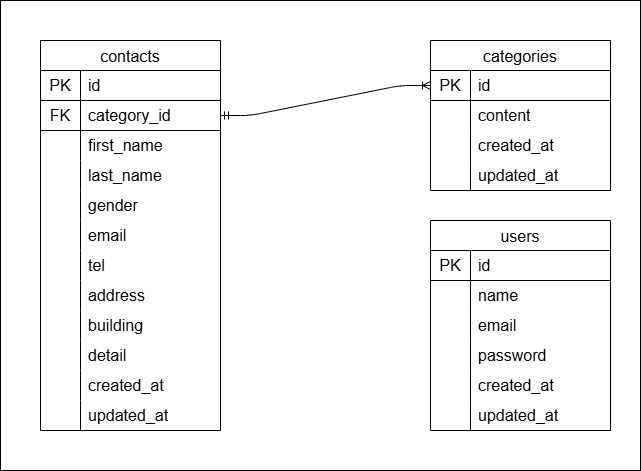

# お問い合わせフォームアプリ

## 概要
Laravel と Docker を用いたシンプルなお問い合わせフォームです。 
お問い合わせ入力、確認、サンクスページが表示されます。 
管理者画面からお問い合わせ内容の一覧表示、検索、削除、CSVエクスポートが可能です。

## 環境構築

### Dockerビルド
1.[git clone リンク](https://github.com/tashima-git/Confirmation-test.git)  
2.docker-compose up -d --build

※ MySQLは、OSによって起動しない場合があるので、それぞれのPCに合わせてdocker-compose.ymlファイルを編集してください。

### Laravel環境構築
<ol>
  <li>docker-compose exec php bash
  <li>composer install
  <li>.env.exampleファイルから.envを作成し、環境変数を変更
  <li>php artisan migrate
  <li>php artisan db:seed
</ol>

## 使用技術
- PHP 8.1.33
- Laravel 10.48.29
- MYSQL　8.0.26

## ER図

## URL
- 開発環境: [http://localhost/](http://localhost/)
- phpMyAdmin: [http://localhost:8080/](http://localhost:8080/)

## 追記
## 追記
- メールアドレス形式のエラーメッセージを表示するため、標準搭載のバリデーションは無効化しています。
- 管理者画面での名前・メールアドレス検索は以下の仕様です:
  - 完全一致データがあればそのデータのみを表示
  - 完全一致がなければ部分一致で検索
- セキュリティ対策として、ユーザー登録時のパスワードは8文字以上を必須にしています。
- ログイン時、認証に失敗した場合は「メールアドレスまたはパスワードが間違っています」と表示するようにしました。
